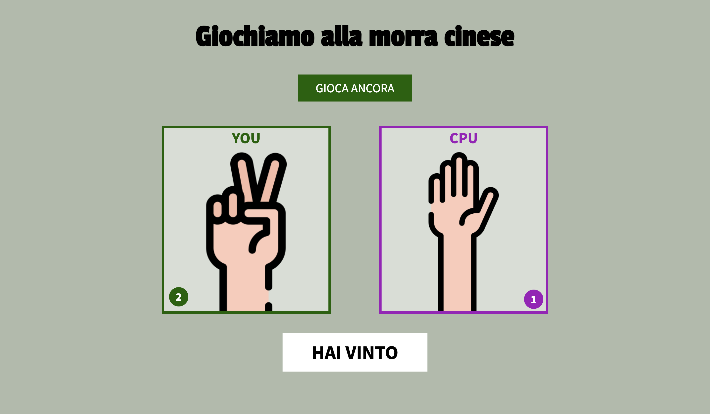

# Morra Cinese

Piccola applicazione web che permette di giocare a morra cinese contro la CPU direttamente nel browser.

## Funzionalità
- scelta tra foglia, forbice e sasso
- generazione casuale della mossa della CPU
- calcolo automatico del vincitore
- aggiornamento del punteggio del giocatore e della CPU
- possibilità di giocare più round con il pulsante **Gioca ancora**

## Tecnologie usate
- HTML
- CSS
- JavaScript

## Come usare il progetto
1. Clona o scarica il repository
2. Apri `index.html` nel browser
3. Clicca su **Fai la tua scelta**
4. Seleziona una tra **foglia**, **forbice** o **sasso**
5. Visualizza il risultato della partita e il punteggio aggiornato

## Struttura del progetto
- `index.html` → struttura della pagina
- `stile.css` → stile dell’interfaccia
- `index.js` → logica di gioco
- `settings.json` → configurazione dell’ambiente di sviluppo

## Regole del gioco
- foglia batte sasso
- forbice batte foglia
- sasso batte forbice

## Note
La CPU sceglie in modo casuale una delle tre mosse disponibili.  
Dopo ogni turno viene mostrato il risultato della partita: vittoria, sconfitta oppure pareggio.

## Demo

